```mermaid
sequenceDiagram
    participant U as User
    participant PC as PointPaymentController
    participant PS as PointPaymentService
    participant ORR as OrderRepository
    participant MR as MemberRepository
    participant PTR as PointTransactionRepository
    U ->> PC: 포인트 결제 요청(orderId, amount)

    alt X-USER-ID 헤더 없음
        PC -->> U: 401 Unauthorized
    else X-USER-ID 헤더 존재
        PC ->> PS: 포인트 결제 요청(userId, orderId, amount)
        PS ->> ORR: 주문 조회(orderId)
        alt 주문 미존재
            ORR --x PS: Exception
            PS -->> PC: 주문 없음
            PC -->> U: 404 Not Found
        else 주문 존재
            ORR -->> PS: orders

            alt 이미 결제 완료
                PS -->> PC: 이미 결제 완료
                PC -->> U: 400 Bad Request
            else 결제 가능
                PS ->> MR: 사용자 조회(userId)
                alt 회원 조회 실패
                    MR --x PS: Exception
                    PS -->> PC: 회원 없음
                    PC -->> U: 404 Not Found
                else 회원 조회 성공
                    MR -->> PS: member

                    alt 보유 포인트 < amount
                        PS -->> PC: 포인트 부족
                        PC -->> U: 400 Bad Request
                    else 충분
                        PS ->> MR: 포인트 차감 요청(userId, -amount)
                        alt 포인트 차감 실패
                            MR --x PS: Exception
                            PS -->> PC: 차감 실패
                            PC -->> U: 500 Internal Server Error
                        else 포인트 차감 성공
                            MR -->> PS: updatedBalance
                            PS ->> PTR: 결제 이력 저장(userId, orderId, amount, "PAY")
                            alt 이력 저장 실패
                                PTR --x PS: Exception
                                PS -->> PC: 이력 실패
                                PC -->> U: 500 Internal Server Error
                            else 이력 저장 성공
                                PTR -->> PS: savedTxn
                                PS ->> ORR: 주문 상태 업데이트(orderId, "PAYED")
                                alt 주문 업데이트 실패
                                    ORR --x PS: Exception
                                    PS -->> PC: 주문 업데이트 실패
                                    PC -->> U: 500 Internal Server Error
                                else 주문 업데이트 성공
                                    ORR -->> PS: updatedOrder
                                    PS -->> PC: 결제 완료(updatedBalance)
                                    PC -->> U: 200 OK (잔액 = updatedBalance)
                                end
                            end
                        end
                    end
                end
            end
        end
    end

    opt 예기치 못한 예외
        PS --x PC: Exception
        PC -->> U: 500 Internal Server Error
    end
```

# 상품 목록 조회

### 기능적 요구사항

(성공 케이스)

- 사용자는 로그인과 관계 없이 상품 목록을 조회할 수 있다.
- 사용자는 로그인을 했다면 찜 상품 목록도 조회할 수 있다.

(실패 케이스)

- 상품이 존재하지 않으면 “오류를 반환한다.”

---

### 비기능적 요구사항

- 사용자 인증은 `X-USER-ID` Header 기반으로 처리한다.
- 상품 목록 조회는 페이징 처리가 되어야 한다.
- 오류 상황에서는 명확한 HTTP 상태코드와 에러메시지를 반환해야 한다.

| 케이스        | 설명                     | HTTP 상태코드         |
|------------|------------------------|-------------------|
| 상품 미존재     | 해당 페이지의 상품이 존재하지 않는 경우 | 200 OK(부분 실패로 판단) |
| 찜 목록 조회 에러 | 해당 페이지 상품의 찜 목록 조회 오류  | 200 OK(부분 실패로 판단) |
| 없는 페이지 요청  | 잘못된 pageNo             | 400 BAD REQUEST   |

### 시퀀스 다이어그램

---

# 상품 등록

### 기능적 요구사항

(성공 케이스)

- 로그인 한 사용자만 상품을 등록할 수 있다.
- 이미지를 함께 올려 상품을 등록할 수 있다.
- 판매자만 상품을 등록할 수 있다.

(실패 케이스)

- 상품 등록에 실패하면 “오류를 반환한다”.
- 이미지 업로드에 실패하면 “오류를 반환한다”.
- `X-USER-ID`가 없으면 “오류를 반환한다”.
- 판매자 권한이 없으면 “오류를 반환한다”.

---

### 비기능적 요구사항

- 사용자 인증은 `X-USER-ID` Header 기반으로 처리한다.
- 상품 등록에 사진은 선택이어야 한다.(최대 10장까지 가능, 확장자 고려)
- 오류 상황에서는 명확한 HTTP 상태코드와 에러메시지를 반환해야 한다.

| 케이스           | 설명                    | HTTP 상태코드          |
|---------------|-----------------------|--------------------|
| 상품 등록 실패      | 상품 등록을 실패하는 경우        | 500 INTERNAL ERROR |
| 이미지 10장 초과    | 이미지가 10장 초과하여 넘어오는 경우 | 400 BAD REQUEST    |
| 이미지 확장자 불일치   | jpg, jpeg, png가 아닌 경우 | 400 BAD REQUEST    |
| 판매자가 아님       | 판매(SELLER) 역할이 없는 경우  | 401 UNAUTHORIZED   |
| X-USER-ID 미존재 | X-USER-ID 헤더가 없는 경우   | 401 UNAUTHORIZED   |

### 시퀀스 다이어그램

---

# 상품 상세보기

### 기능적 요구사항

(성공 케이스)

- 상품 이미지를 정상적으로 표출한다.
- 상품 좋아요 수, 찜 상태를 정상적으로 표출한다.
- 본인이 올린 글이면 수정, 삭제 버튼을 표출한다.

(실패 케이스)

- 상품 정보 조회에 실패하면 “오류를 반환한다”.
- `X-USER-ID`가 없으면 “오류를 반환한다”.

---

### 비기능적 요구사항

- 사용자 인증은 `X-USER-ID` Header 기반으로 처리한다.
- 오류 상황에서는 명확한 HTTP 상태코드와 에러메시지를 반환해야 한다.

| 케이스           | 설명                   | HTTP 상태코드          |
|---------------|----------------------|--------------------|
| 상품 조회 실패      | 상품 정보 조회를 실패하는 경우    | 500 INTERNAL ERROR |
| 상품 이미지 조회 실패  | 상품 이미지 조회를 실패하는 경우   | 200 OK(사진만 빼고 제공?) |
| 찜 조회 실패       | 찜 정보 조회를 실패하는 경우     | 200 OK             |
| 판매자가 아님       | 판매(SELLER) 역할이 없는 경우 | 401 UNAUTHORIZED   |
| X-USER-ID 미존재 | X-USER-ID 헤더가 없는 경우  | 401 UNAUTHORIZED   |

### 시퀀스 다이어그램

---

# 브랜드 목록 조회

### 기능적 요구사항

(성공 케이스)

- 브랜드의 목록을 성공적으로 조회한다.

(실패 케이스)

- 브랜드 목록 조회에 실패하면 “오류를 반환한다

---

### 비기능적 요구사항

- 오류 상황에서는 명확한 HTTP 상태코드와 에러메시지를 반환해야 한다.

| 케이스       | 설명                 | HTTP 상태코드          |
|-----------|--------------------|--------------------|
| 브랜드 조회 실패 | 브랜드 정보 조회를 실패하는 경우 | 500 INTERNAL ERROR |

### 시퀀스 다이어그램

---

# 브랜드 상세 조회

### 기능적 요구사항

(성공 케이스)

- 브랜드 상세 정보를 성공적으로 조회한다.
- 브랜드의 상품 리스트를 같이 조회한다.

(실패 케이스)

- 브랜드 상세 정보 조회에 실패하면 “오류를 반환한다”.
- 브랜드의 상품 리스트 조회에 실패하면 “브랜드 정보만 반환한다”.

---

### 비기능적 요구사항

- 오류 상황에서는 명확한 HTTP 상태코드와 에러메시지를 반환해야 한다.

| 케이스              | 설명                     | HTTP 상태코드          |
|------------------|------------------------|--------------------|
| 브랜드 조회 실패        | 브랜드 정보 조회를 실패하는 경우     | 500 INTERNAL ERROR |
| 브랜드 상품 리스트 조회 실패 | 브랜드 상품 리스트 조회를 실패하는 경우 | 200 OK             |

### 시퀀스 다이어그램

---

# 상품 좋아요 등록, 취소

### 기능적 요구사항

(성공 케이스)

- 상품 좋아요 상태가 아니라면 좋아요를 등록한다.
- 상품 좋아요 상태라면 좋아요를 취소한다.
- 로그인 유저만 좋아요 등록, 취소 기능이 가능하다.

(실패 케이스)

- 좋아요를 눌렀지만 좋아요가 동작하지 않는다.
- 좋아요 취소를 눌렀지만 좋아요 취소가 동작하지 않는다.
- `X-USER-ID`가 없으면 “오류를 반환한다”.

---

### 비기능적 요구사항

- 사용자 인증은 `X-USER-ID` Header 기반으로 처리한다.
- 오류 상황에서는 명확한 HTTP 상태코드와 에러메시지를 반환해야 한다.

| 케이스           | 설명                   | HTTP 상태코드          |
|---------------|----------------------|--------------------|
| 좋아요 실패        | 좋아요를 눌렀지만 실패하는 경우    | 500 INTERNAL ERROR |
| 좋아요 취소 실패     | 좋아요 취소를 눌렀지만 실패하는 경우 | 500 INTERNAL ERROR |
| X-USER-ID 미존재 | X-USER-ID 헤더가 없는 경우  | 401 UNAUTHORIZED   |

### 시퀀스 다이어그램

---

# 포인트 충전하기

### 기능적 요구사항

(성공 케이스)

- 로그인한 사용자는 원하는 금액만큼 포인트를 **충전**할 수 있다.
- 충전이 완료되면 **현재 보유 포인트**(잔액)를 함께 반환한다.

(실패 케이스)

- 결제 승인에 실패해 **포인트 충전이 동작하지** 않는다.
- 요청 금액이 **0 원 이하**이면 오류를 반환한다.
- `X-USER-ID`헤더가 없으면 오류를 반환한다.

---

### 비기능적 요구사항

- 사용자 인증은 `X-USER-ID` Header 기반으로 처리한다.
- 오류 상황에서는 명확한 HTTP 상태코드와 에러메시지를 반환해야 한다.

| 케이스           | 설명                               | HTTP 상태코드          |
|---------------|----------------------------------|--------------------|
| 충전 실패         | 충전 실패, DB 업데이트 등등 오류로 인해 실패하는 경우 | 500 INTERNAL ERROR |
| 금액 검증 실패      | amount가 0이거나 음수인 경우              | 400 BAD REQUEST    |
| X-USER-ID 미존재 | X-USER-ID 헤더가 없는 경우              | 401 UNAUTHORIZED   |

### 시퀀스 다이어그램

---

# 주문하기

### 기능적 요구사항

(성공 케이스)

- 로그인한 사용자가 **장바구니 상품을 주문**할 수 있다.
- 주문 시 **재고가 차감**되고 주문 내역이 저장된다.
- 주문이 완료되면 **주문 ID와 결제 금액**을 반환한다.

(실패 케이스)

- 재고가 부족하면 주문이 동작하지 않는다.
- 주문 저장(또는 결제 승인) 과정에서 오류가 나면 주문이 동작하지 않는다.
- `X‑USER‑ID`헤더가 없으면 오류를 반환한다.

---

### 비기능적 요구사항

- 사용자 인증은 `X-USER-ID` Header 기반으로 처리한다.
- 오류 상황에서는 명확한 HTTP 상태코드와 에러메시지를 반환해야 한다.

| 케이스           | 설명                   | HTTP 상태코드          |
|---------------|----------------------|--------------------|
| 주문 저장 실패      | DB 저장, 결제 승인 등 내부 오류 | 500 INTERNAL ERROR |
| 재고 부족         | 주문 수량이 재고보다 많음       | 400 BAD REQUEST    |
| X-USER-ID 미존재 | X-USER-ID 헤더가 없는 경우  | 401 UNAUTHORIZED   |

### 시퀀스 다이어그램

---

# 결제하기

### 기능적 요구사항

(성공 케이스)

- 로그인한 사용자가 **보유 포인트**로 주문을 결제한다.
- 결제가 완료되면 **포인트 잔액**과 **주문 ID**를 반환한다.
- 결제 성공 시 주문 상태가 **“PAYED”**(또는 “결제완료”)로 갱신된다.

(실패 케이스)

- 결제 금액보다 보유 포인트가 부족하면 결제가 동작하지 않는다.
- 주문이 존재하지 않거나 이미 결제 완료된 주문이면 결제가 동작하지 않는다.
- 포인트 차감·결제 이력 저장 중 오류가 발생하면 결제가 동작하지 않는다.
- `X‑USER‑ID`헤더가 없으면 오류를 반환한다.

---

### 비기능적 요구사항

- 사용자 인증은 `X-USER-ID` Header 기반으로 처리한다.
- 오류 상황에서는 명확한 HTTP 상태코드와 에러메시지를 반환해야 한다.

| 케이스           | 설명                      | HTTP 상태코드          |
|---------------|-------------------------|--------------------|
| 주문 미존재        | orderId에 해당하는 주문이 없음    | 404 NOT FOUND      |
| 이미 결제 완료      | 주문 상태가 이미 PAYED         | 400 BAD REQUEST    |
| X-USER-ID 미존재 | X-USER-ID 헤더가 없는 경우     | 401 UNAUTHORIZED   |
| 포인트 부족        | 보유 포인트 < 결제 금액          | 400 BAD REQUEST    |
| 결제 로직 실패      | 포인트 차감·이력 저장·주문 업데이트 오류 | 500 INTERNAL ERROR |

### 시퀀스 다이어그램

---

# 쿠폰 목록 조회하기

쿠폰과 사용자를 하나의 애그리거트로 묶는다면

즉, 생명주기가 같다고 본다면 MemberController에서 쿠폰을 조회하는게 맞다고 판단.

그러나 쿠폰과 사용자를 독립 객체로 바라본다면 CouponController에서 받는 게 더 적합하다고 판단.

---