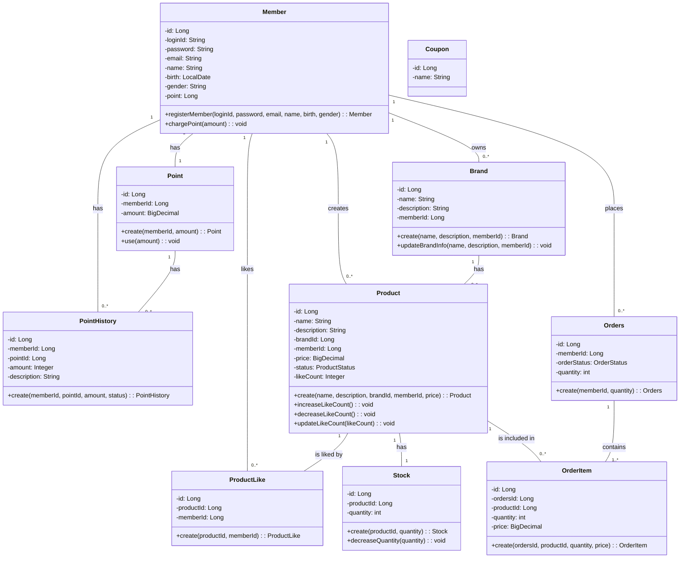

```mermaid
classDiagram

  class Member {
    -id: Long
    -loginId: String
    -password: String
    -email: String
    -name: String
    -birth: LocalDate
    -gender: String
    -point: Long
    +registerMember(loginId, password, email, name, birth, gender): Member
    +chargePoint(amount): void
  }

  class Point {
    -id: Long
    -memberId: Long
    -amount: BigDecimal
    +create(memberId, amount): Point
    +use(amount): void
  }

  class PointHistory {
    -id: Long
    -memberId: Long
    -pointId: Long
    -amount: Integer
    -description: String
    +create(memberId, pointId, amount, status): PointHistory
  }

  class Brand {
    -id: Long
    -name: String
    -description: String
    -memberId: Long
    +create(name, description, memberId): Brand
    +updateBrandInfo(name, description, memberId): void
  }

  class Product {
    -id: Long
    -name: String
    -description: String
    -brandId: Long
    -memberId: Long
    -price: BigDecimal
    -status: ProductStatus
    -likeCount: Integer
    +create(name, description, brandId, memberId, price): Product
    +increaseLikeCount(): void
    +decreaseLikeCount(): void
    +updateLikeCount(likeCount): void
  }

  class ProductLike {
    -id: Long
    -productId: Long
    -memberId: Long
    +create(productId, memberId): ProductLike
  }

  class Orders {
    -id: Long
    -memberId: Long
    -orderStatus: OrderStatus
    -quantity: int
    +create(memberId, quantity): Orders
  }

  class OrderItem {
    -id: Long
    -ordersId: Long
    -productId: Long
    -quantity: int
    -price: BigDecimal
    +create(ordersId, productId, quantity, price): OrderItem
  }

  class Stock {
    -id: Long
    -productId: Long
    -quantity: int
    +create(productId, quantity): Stock
    +decreaseQuantity(quantity): void
  }
  
  class Coupon {
    -id: Long
    -name: String
  }

  Member "1" -- "1" Point : has
  Member "1" -- "0..*" PointHistory : has
  Member "1" -- "0..*" Brand : owns
  Member "1" -- "0..*" Product : creates
  Member "1" -- "0..*" ProductLike : likes
  Member "1" -- "0..*" Orders : places
  
  Point "1" -- "0..*" PointHistory : has
  
  Brand "1" -- "0..*" Product : has
  
  Product "1" -- "0..*" ProductLike : is liked by
  Product "1" -- "1" Stock : has
  Product "1" -- "0..*" OrderItem : is included in
  
  Orders "1" -- "1..*" OrderItem : contains

```