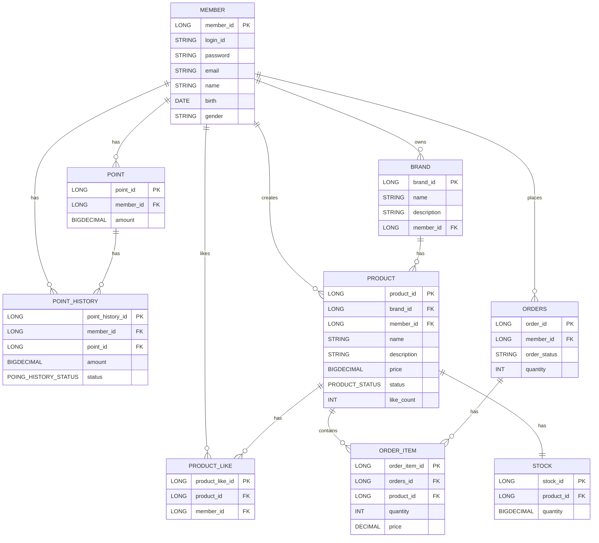

```mermaid

erDiagram
%% 등록시간, 수정시간 생략
    MEMBER {
        LONG member_id PK
        STRING login_id
        STRING password
        STRING email
        STRING name
        DATE birth
        STRING gender
    }

    POINT {
        LONG point_id PK
        LONG member_id FK
        BIGDECIMAL amount
    }

    POINT_HISTORY {
        LONG point_history_id PK
        LONG member_id FK
        LONG point_id FK
        BIGDECIMAL amount
        POING_HISTORY_STATUS status
    }

    BRAND {
        LONG brand_id PK
        STRING name
        STRING description
        LONG member_id FK
    }

    PRODUCT {
        LONG product_id PK
        LONG brand_id FK
        LONG member_id FK
        STRING name
        STRING description
        BIGDECIMAL price
        PRODUCT_STATUS status
        INT like_count
    }

    PRODUCT_LIKE {
        LONG product_like_id PK
        LONG product_id FK
        LONG member_id FK
    }

    ORDERS {
        LONG order_id PK
        LONG member_id FK
        STRING order_status
        INT quantity
    }

    ORDER_ITEM {
        LONG order_item_id PK
        LONG orders_id FK
        LONG product_id FK
        INT quantity
        DECIMAL price
    }

    STOCK {
        LONG stock_id PK
        LONG product_id FK
        BIGDECIMAL quantity
    }

    MEMBER ||--o{ BRAND: owns
    MEMBER ||--o{ PRODUCT: creates
    MEMBER ||--o{ POINT: has
    MEMBER ||--o{ POINT_HISTORY: has
    MEMBER ||--o{ PRODUCT_LIKE: likes
    MEMBER ||--o{ ORDERS: places
    BRAND ||--o{ PRODUCT: has
    PRODUCT ||--o{ PRODUCT_LIKE: has
    PRODUCT ||--o{ ORDER_ITEM: contains
    PRODUCT ||--|| STOCK: has
    ORDERS ||--o{ ORDER_ITEM: has
    POINT ||--o{ POINT_HISTORY: has

```